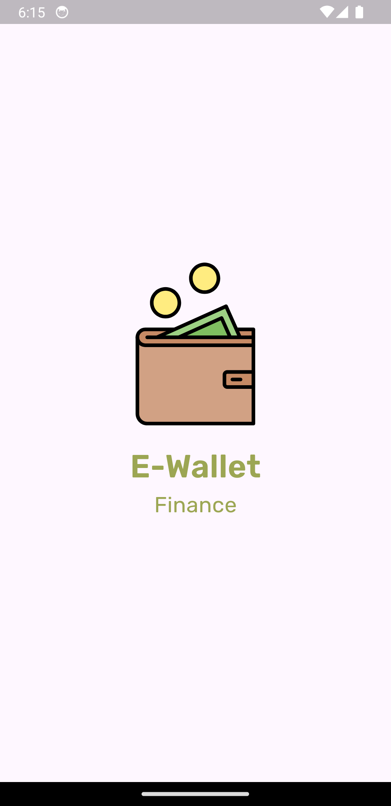
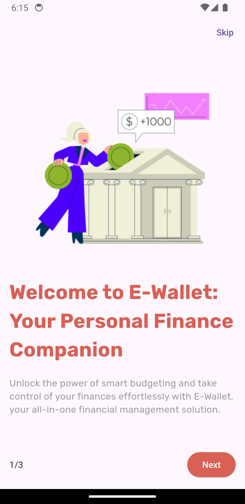
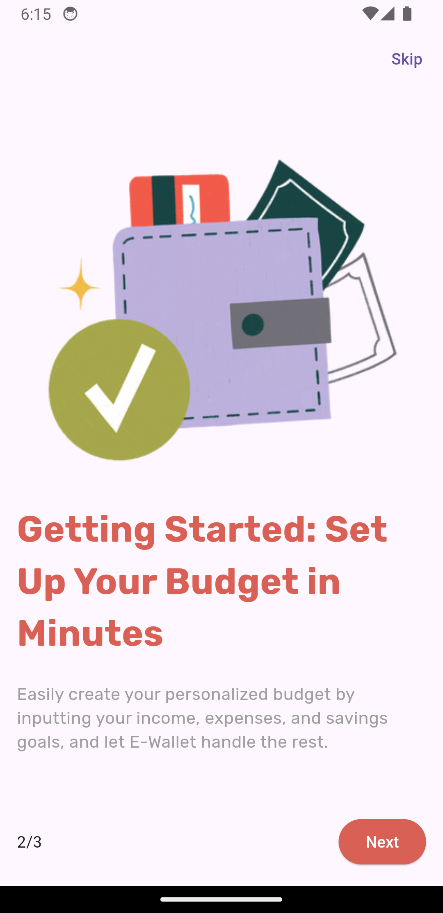
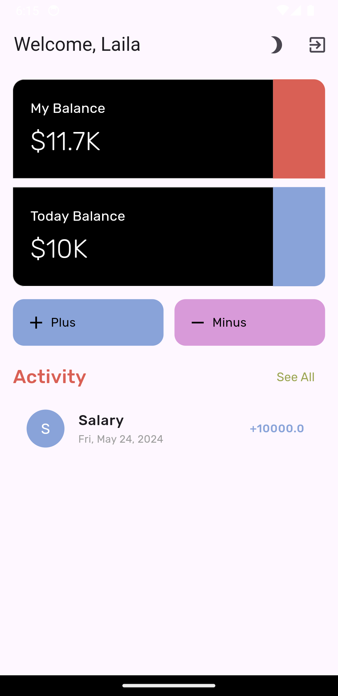
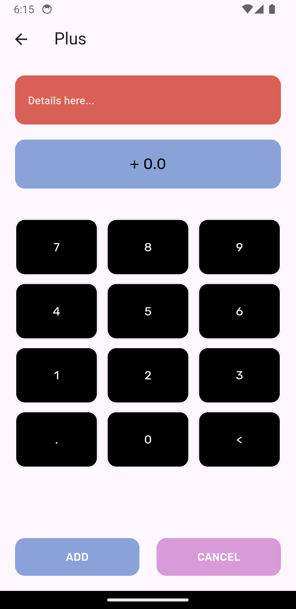
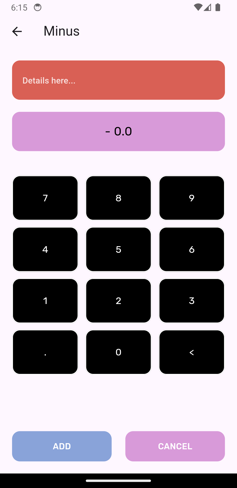
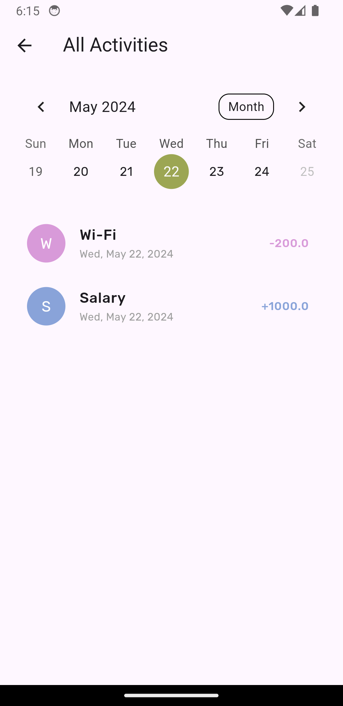
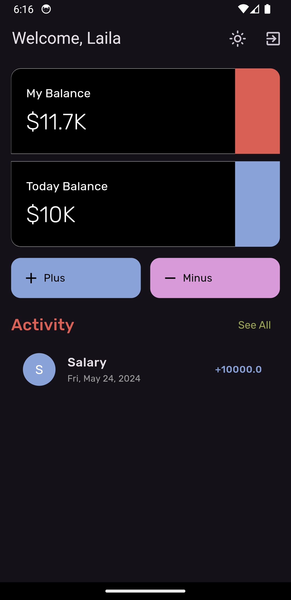

# E-Wallet App

The E-Wallet App is a mobile application designed to give users a convenient way to manage their finances. With features for tracking expenses, setting budgets, and gaining insights into spending habits, this app aims to empower users to make informed financial decisions.

    

## Features

- **Splash Screen**: The app starts with a splash screen displaying the logo and app name.
- **Onboarding Pages**: Users are guided through onboarding screens where they learn about the app's features and how to set up their budget.
- **Home Screen**: The main dashboard displays your balance, today's balance, and recent activities. You can add new transactions (income or expenses), update or delete existing ones and view all activities.
- **All Activities Page**: This page lets you view all transactions and filter them by date using a calendar.
- **Add and Minus Page**: Users can add new transactions, either as income or expenses, with details and amounts.
- **Models**: The app uses [Hive](https://docs.hivedb.dev/#/README) for local database storage. The `WalletModel` class represents each transaction.

## Screenshots

 
 
 

  
  
  

  
  
  

## Technologies Used

- Flutter: A framework for building cross-platform mobile applications.
- [Hive](https://docs.hivedb.dev/#/README): A lightweight and fast key-value database for storing local app data.
- Bloc(Cubit): A state management library for Flutter applications, facilitating the separation of UI and business logic.

## Getting Started

To run the E-Wallet app on your local machine, follow these steps:

1. Clone this repository to your local machine.
2. Ensure you have Flutter installed. If not, follow the instructions [here](https://flutter.dev/docs/get-started/install).
3. Open the project in your preferred IDE.
4. Run `flutter pub get` to install dependencies.
5. Connect a device or emulator and run `flutter run` to launch the app.

## Dependencies

- `flutter_bloc`: For state management using the BLoC pattern.
- `hive_flutter`: For local database storage using Hive.
- `intl`: For date formatting.
- `table_calendar`: For displaying a calendar widget.
- `gap`: For adding vertical spacing between widgets.
  
## Contributing

Contributions are welcome! Feel free to open an issue or submit a pull request if you have any ideas for new features, improvements, or bug fixes.
